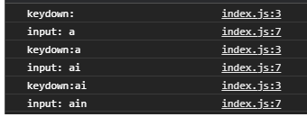

## keypress vs keyup vs keydown 

&ensp; 평소 리액트로 개발을 하다가 회사에서 직접 DOM을 조작하고 WEB API를 이용해 개발할 일이 생겼다. 초반에 keypress, keyup, keydown이 비슷해서 구분하지 않고 썼다가 미묘한 차이 때문에 애를 먹은적이 있어 정리하려고 한다. 

&ensp; 세가지 모두 키가 입력이 있을 때 발생하는 event의 종류이다. 하지만 각각이 미묘하게 발생하는 시점이 다르고, 입력되어 들어오는 정보도 미묘하게 다르다. 이를 함께 실험해보며 알아보자.

가장 먼저 input html에 input을 생성하고 input을 선택해주자.

index.html
```html

<!DOCTYPE html>
<html lang="en">

<head>
    <meta charset="UTF-8">
    <meta name="viewport" content="width=device-width, initial-scale=1.0">
   
    <title>Document</title>
</head>

<body>
    <input type="text" class='text-input'></input>
    <script defer src="./app.js"></script>
</body>

</html>

```

app.js
```js
const textInput = document.querySelector('.text-input');

```

## 1) keypress

keypress 는 키가 입력될 때 발생하는 이벤트로 키가 입력 되었을 때 해당 event가 발생된다.
```js
textInput.addEventListener('keypress', (e) => {
    console.log(e);
});
```
 &ensp; 이제 input에 값을 입력해보자! (브라우저에 따라 작동이 되지 않을 수도 있다.) 입력되는 값은 A-Z, a-z, enter, " ", 등일 것이다. 이 이벤트는 다른 두 이벤트와는 다르게 한글과 modifier key인 Tab, Shift, ctrl, alt 등을 입력할 때는 발생되지 않는것을 알 수 있을 것이다. 또한 MDN에 따르면 더이상 지원하지 않는 deprecated된 기능으로써 앞으로 많은 브라우저에서 지원을 중단하게 되기 때문에 keydown을 사용하라고 추천하고 있다! 


## 2) keydown

```js
textInput.addEventListener('keydown', (e) => {
    console.log(e);
});
```
keydown을 입력해보면 위의 keypress와는 다르게 한글은 물론 다른 modifier key들을 입력할 때에도 이벤트가 발생하는 것을 볼 수 있을 것이다! keydown 또한 key가 눌려질 때 이벤트가 발생된다. 그렇다면 keyup과 차이를 알아보자! key를 눌렀을 때 input에서 값을 받아와보자.

```js
const textInput = document.querySelector('.text-input');
textInput.addEventListener('keydown', (e) => {
    console.log(textInput.value);
});
```
이런 식으로 간단하게 고쳐서 value를 확인해보자. 그러면 이상한 일이 벌어질 것이다. 예상으로는 처음에 입력한 값이 console에 출력이 될 것 같은데 출력이 되지 않고, 빈 공백이 출력이 되고, 다시한번 입력을 하면 한발 늦게 이전에 입력한 값이 나온다. 계속해서 입력을 해보아도 이렇게 한발씩 늦은 값이 입력이 된다. 이렇게 값이 예상과 달리 나오는 이유는 keydown은 key가 눌리는 동시에 이벤트가 발생되기 때문에 input에 값이 들어가기 전에 값이 입력이 된다. 이는 다음 코드를 통해 확인 할 수 있다. 

```js
const textInput = document.querySelector('.text-input');
textInput.addEventListener('keydown', (e) => {
    console.log("keydown:" + textInput.value);
});

textInput.addEventListener('input', (e) => {
    console.log("input: " + e.target.value)
})
```




이를 보면 값을 입력했을 때 keydown이벤트가 먼저 발생 한 후 input이 발생하는 것을 확인 할 수 있다. 이를 볼 때, input의 위의 코드가 input에 새롭게 들어오는 값을 못 읽어오는 것은 당연하다! 


&ensp; 이렇게만 보면 keydown이 조금은 무능하게 보일 수 있을 것 같다. 하지만 지금 키를 한번 지긋이 눌러보자. 위의 사진 처럼 예상대로 여러 값들이 연속적으로 입력이 되는 것을 보고 있으면 keydown을 사용하는 이유를 보고 있는 것이다. keydown은 keyup과 다르게 key를 up 하지 않아도 계속해서 발생이 되기 때문에 연속 입력이 될 때 사용을 한다. keyup을 보며 같이 비교해보자.


## 3) keyup

```js
textInput.addEventListener('keydown', (e) => {
    console.log(e);
});
```
keyup은 말 그대로 key가 up 될 때, 키가 올라갈 때 발생하는 이벤트다. 잘 이해가 되지 않으면 위의 코드를 app.js에 입력하고 아무키나 꾹 눌러보자. 꾹 키를 누를 경우 input에 반복 입력이 되지만 키를 땔 때까지 keyup은 발생하지않는다. 그렇기 때문에 연속입력을 처리 할 때는 keyup보다 keydown이 더 적절하다. 하지만 위에서 언급 했듯이 이벤트가 발생했을 때 해당 input으로부터 값을 얻어와야 할 때는 keydown을 사용해야 한다.


## 4) keydown과 keyup 이벤트의 발생 시점
 마지막으로 keyup의 발생 순서를 한반 확인해보고 설명을 마치겠다. 

 ```js
textInput.addEventListener('keydown', (e) => {
    console.log('keydown');
});

textInput.addEventListener('keyup', (e) => {
    console.log('keyup');
});

textInput.addEventListener('input', (e) => {
   console.log('input');
});

```

&ensp;이렇게 등록을 해두면 우리가 앞에서 확인 했던 내용을 토대로 생각해 봤을 때 입력을 하면, keydown->input->keyup 순으로 이벤트가 일어날 것으로 예상된다. 
결과를 확인 해 보자!


&ensp; 맞다! 우리가 생각 했던 대로 key입력이 일어나자마자 keydown이 발생하고 값이 input 영역에 입력되어 input 이벤트가 발생하고, key가 올라가면서keyup이벤트가 발생한다! 

## 5) 마치며
&ensp; 오늘은 비슷한 듯 하면서 미묘하게 다른 keypress, keydown, keyup 이벤트 등을 비교해 보았다. keypress는 한글, 그리고 modifier key를 제외한 키가 눌릴 때 발생하는 이벤트이고, deprecated 되어 사용하지 않는 것을 추천하고 있는 것을 알아보았다. 그리고 keydown은 키가 눌릴 때, keyup은 key가 올라올 때 각각 발생하는 이벤트임을 실험을 통해 알아보았다. 앞으로는 이러한 순서와 미묘한 차이를 기억하며 이벤트 처리에 있어서 유의하면서 코드를 작성해야겠다.


## 참고 

* [keypress MDN 문서](https://developer.mozilla.org/ko/docs/Web/API/Document/keypress_event)
* [keydown MDN 문서](https://developer.mozilla.org/ko/docs/Web/API/Document/keydown_event)
* [keyup MDN 문서](https://developer.mozilla.org/ko/docs/Web/API/Document/keyup_event)


