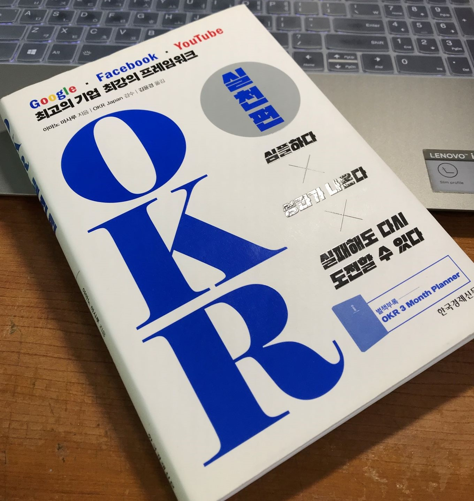

# OKR 실천편




&ensp;지금 다니는 회사에서는 성과 중심 조직을 위한 실행 방법론인 OKR(Objective. Key Result)를 사용하고있다. 입사를 하면서 OKR과 관련된 책을 선물로 받아 이를 읽어보게 되었다. 이 OKR이라는 방법을 요약해서 설명하면 핵심 목표를 세우고(Object), 그 목표를 이루기 위해 해야 할 핵심 결과를 정하고(Key Result) 그 결과를 평가하는 것이다. 이 책을 읽으며 이러한 방법론이 한 조직의 업무효율과 방향을 증대 시키는 것은 물론 개개인에게 적용해도 자신이 이루려고 하는 목표를 설정하고, 이를 이루기 위해 해야 하는 일들을 정의 하고 실천해 나가게 될 수 있을 것 같다는 생각이 들었다. 그래서 이러한 내용을 잊지 않기 위해 목차별로 핵심을 정리해두려고 한다. 


## 1장 OKR의 기본 

* 목표는 왜 중요한가
  - 목표가 있을 때 구성원의 성과를 최대한으로 이끈다. 여러명이 모여서 하나의 목표를 가질 때 함께 같은 일을 할 수 있는 것이다. 하지만 서로 하려고하는 일, 즉 목표가 다르다면 팀의 의미가 없을 것이다. 그렇기 때문에 목표가 필요한 것인데, 이 목표를 정할 때에는 구성원이 참여해서 정하도록 하는 것이다. 하지만 이러한 목표를 정하더라도 항상 목표에 맞는 만족스러운 성과를 낼 수 없기 때문에 계속해서 이를 수정하고 행동의 방향을 수정하는 것이 필요하다.

* OKR은 무엇인가?
  - Objective Key Result 는 '목표'와 '핵심 결과 지표' 라는 두 단어의 첫 글자를 딴 용어로 조직이나 팀, 개인의 이성적인 상태를 달성하기 위한 도구이다. 
  - 팀에서 이를 적용할 때는 보통 '목표'를 명문화 하고, 4~5가지 핵심결과 지표를 정하는데, 이 결과 지표는 정량적 평가가 가능해야 한다. 
  - OKR을 적용하기 위해서는 4가지 원칙이 있다. 
  ```
      1. 집중: 중요한 것을 선택해 자원을 집중하는 것.(시간, 인력 등등)
      2. 정렬: 여러개의 요소를 하나의 목표를 위해 정렬 한다. 
      3. 추적: 처음과 끝만을 확인 하는 것이 아니라 중간의 일이 진행되는 상황을 확인하고 이해해 장애물을 최소화 한다.  
      4. 도전: 실패해도 이를 뒷받침 해줄 수 있는 상황에서 지속적으로 도전해야 한다.  
  ```
* 이 성과를 만들어내는 구조
  - 목표관리 방법은 크게 '공격형 목표 관리'와 '수비형 목표 관리'로 나눌 수 있다. 공격형은 새로운 것을 창조하는데 중점을, 수비형은 현재 있는 것을 잃지 않는 것에 초점을 맞추는 목표이다.  OKR은 이 중 공격형에 적합하다.  그리고, OKR은 이에 맞추어 목표를 야심적으로, 할 수 있을 것보다 높게 잡아 큰 성과를 내고 새로운 아이디어를 창출 하도록 한다. 
  - 목표를 높게 잡았기 때문에 이를 달성하면 큰 성과가 난다. 물론 높은 목표이기 때문에 실패가 허용되어야 한다. 그렇지 않으면 구성원들은 달성할 수 있는 목표치만을 설정하게 될 것이다.
  - 멀리 있는 목표를 세우게 되면 이에 대해 세부적인 사항에 대한 충돌이 적어지고 시야가 넓어져 새로운 아이디어가 창출되기 쉽다. 

* OKR에 관한 오해 
  - OKR은 스타트업만이 사용할 수 있는 방법이 아니다! 
  - OKR은 개인의 목표를 위해서도 사용할 수 있다!
  - OKR은 개인의 실적 평가를 위한 것이 아니다. 
  - OKR의 지표는 관리 부서가 아니라 개별 부서가 지표를 정하는 것이 좋다.
  - OKR의 지표는 리더와 구성원이 모두 납득해서 결정해야 된다. 

* OKR의 장점
  - 큰 목표를 세우기 때문에 이를 완전히 달성하지 못해도 큰 성과가 보장된다.
  - 함께 정한 목표와 일이기 때문에 책임의식을 가지게 된다. 
  - 야심적인 목표를 세울 수 있기 때문에 도전하기 쉬워진다. 
  - key Result를 측정해 활동이 얼마나 진행되었는지 객관적으로 알 수 있다.
  - 함께 OKR을 사용하고 있으면 서로 협력이 쉬워진다. 

## 2장 OKR의 시작 

* 목표 결정 프로세스
  - OKR의 두 큰 프로세스는 '목표 결정 프로세스와'과 '목표를 향한 프로세스'다.  구성원의 힘을 합쳐 자신들이 결정한 목표를위해 나아간다.  
  - 그 중 목표 결정 프로세스는 다음과 같은 과정을 거친다. 2장에서 아래의 내용을 세세하게 설명한다.

        - 범위를 정한다 -> 팀의 미션을 결정한다. -> 마일스톤을 정한다.-> 모델을 작성한다. -> 목표를 결정한다. 

* 팀의 범위를 결정한다.
    - 중심 업무를 선택하고 그 업무에 깊이 관여하고 있는 구성원으로 OKR을 시작한다. 

* 팀의 미션을 결정한다.
  - 미션은 그 팀이 수행해야 할 과제로서 팀 전원이 함께 절정해야 한다. 
  - 팀이 존재함으로 어떤이점이 생기는지, 원활하지 못 할 경우 어떤 손해가 발생하는지 언어로 문장화 해보자. 

* 마일스톤을 작성한다.
  - 미션의 유형을 확인 해야한다. 창조? or 유지?
  - Objective 는 의욕을 고취시키는 내용으로 한다.
      - ex) 아이디어가 생각이 나면 막힘 없이 서버와 프론트를 구성할 수 있는 개발자가 될 수 있도록 공부하겠다.
  
* 모델을 작성한다.
  -  모델은 목표를 당성하기 위한 핵심 지표를 정하는 과정이다. 핵심 지표는 수치로 표현 할 수 있어야 한다.
  -  팀의 성과를 올리기 위해 어떠한 활동이 어떻게 영향을 미치는지 이해하고 있어야 한다. 이러한 활동과 영향을 '인과 루프 도표'로 정리하면 그 인과를 분석해 key Result를 정하기 쉬워진다. 

* 목표를 결정한다.
  - 위에서 정한 모델을 기반으로 어떠한 수치에 주목할지 결정해서 모델 중에서 3가지 정도를 지표로 선택해 최종적으로 KR을 결정한다. 
  - KR은 계속 말 하고 있지만 수치가 있어야 한다. 그리고 정해진 목표는 우선순위를 매겨야 한다. 
* 핵심결과 지표는 SMART로 생각한다.
  - S: specific 
  - M: Measurable 
  - A: Ambitious 
  - R: Relevant 
  - T: Time-bound
* OKR의 설정 사례
 - 이 장에서는 OKR을 실제로 적용한 예시가 나오는데, 이에 기반해서 나도 직접 작성해 보았다. 
  
  Objective: 뛰어난 프론트앤드 개발자가 된다. 

  Key Result:

    * 개인 프로젝트를 1달이내에 1개 이상 끝낸다.
    * YDKJS를 1달 이내로 다 읽는다.
    * 1주일에 한 포스트씩 개발과 관련한 트랜드를 정리한다.

## 3장 OKR의 사용

* 목표를 향한 프로세스를 확인한다.

  - 앞서서 정한 목표를 실행하는 프로세스를 정한다. 
  - PDCA 검토법 Plan-Do-Check-Act

* 운용을 설계 한다.

  - 행동이 핵심 지표에 좋은 영향을 미치고 있는지, 행동이 이루어지고 있는지, 어떻게 확인할 것인지 결정한다. 
  - 함께 모여서 목표를 위해서 어떻게 행동을 하고 있는지 서로 체크하는 시간을 가진다고 보면 될 것 같다.
  - 일주일에 두번 팀리더-팀 회의, 기획자- 팀 회의 를 진행한다. 


* 행동을 결정한다.
  - 핵심 결과 지표를 달성하기 위해 일주일간 어떤 행동을 할지 의논해 과제를 정리하는 것이다. 
  - 업무의 과제 규모는 하루 이내에 완료할 수 있는 정도로 해야한다. 규모가 너무 크면 관리가 어렵다.
  - 태스크 보드를 이용해서 행동을 관리한다. -> 칸반보드를 사용하고 있음.
* 행동한다.
  - 행동한다. 멀티태스킹을 하지 않는다.
* 달성 상황을 평가한다.
  - 행동 후 주 1회 브리핑 시간을 통해 달성 상황을 평가한다. 
* 행동을 재검토 한다. 
 - 핵심 결과 지표의 달성을 향해 잘 가도, 그렇지 못해도 재검토는 필요하다. 
 - 결과에 영향을 미치는 '행동 지표'와 그 결과인 '결과 지표' 를 나누어 행동을 재검토 한다.

* 최종적인 달성 상황을 평가한다.
  - 목표에 가까이 와있는지 체크한다. 
* OKR 브리핑의 진행 방법
  - KPT 컴토법 Keep, Problem, Try, Action,
* OKR을 '매일 점검' 하는 방법
  - 하루할 일을 정한다. 
  - 각자 보고한다 1. 어제 한 일 2 어제 할 일 3. 목표와 핵심 결과지표 달성을 방해하는 장애물.
* 개인 면담을 진행하는 방법
* OKR 매니지먼트 보드의 활용

## 4장 조직 내 OKR의 사용 

- &ensp;4장에서는 기업 전체에 OKR을 도입하려고 할 때 어떠한 과정을 거쳐서 도입하게 되는지, 어떻게 구성원들이 OKR을 받아들이고 이에대해 숙련되도록 할 것인지에 대해서 설명하는 장이다.

* OKR의 조직 도입 패턴

  - 기업 전체에서 OKR을 도입하려고 할 때 다음의 3단계를 거친다. 
  1. 기획: 기업 내에서 추진하기 위한 조직을 구성
  2. 전개: OKR의 도입률을 늘림.
  3. 정착: 기업 내의 시스템으로 운용하는 것. 

* 1단계: 기획 진행 방법
  - OKR에 익숙한 적은 인원으로 추진팀을 구성한다. 
  - 추진 팀의 OKR을 설정한다. 
  - 왜 OKR을 도입하는지, 등등 지침서를 작성한다. 
  - 이 장에서는 OKR을 조직내의 구성원들이 익숙해지도록 하기 위해 해야 하는 여러 일들을 설명하고 있다. 
* 2단계: 전개 진행 방법
* 3단계: 정착 진행 방법
* 계층형 조직의 OKR
* 매트릭스형 조직의 OKR

## 마치며 
- &ensp;성과를 내기 위해서 목표와 핵심 결과를 명확히 정의해 이를 이루기 위한 행동을 하는 방법론이 굉장히 단순해 보인다. 하지만 이러한 방법론을 이용하면 내가 무엇을 하려는지 확실히 알 수 있고, 그 목표를 이루기 위해 해야할 것들을 명확히 정의해 둔다면, 분산되는 관심을 정렬해 각 구성원들의 행동을 최적화 시킬 수 있다는 생각이 들었다. OKR을 사용하지 않는다면 어떠한 목표를 설정을 했는데, 그 목표를 이루기 위해 해야 할 것을 정의하지 않기 쉽다. 이렇게 되면 그 목표를 이루기 위해 '좋아보이는 것'을 할것이다. 하지만 이렇게 '좋아보이는 것'을 하다보면 목표를 잊기 쉽고 목표를 잊지 않더라도 '좋아보이는 것'을 진행하는데 문제가 생긴다면 그 행동에 대한 정의나 명문화가 없기 때문에 쉽게 좌절되거나 이를 포기할 수 있다. 그렇기 때문에 OKR을 통해 목표(Objective)와 핵심 지표(Key Result)를 정하는 것이 중요하다는 생각이 든다! 


[OKR 실천편](http://www.yes24.com/Product/Goods/83558014)