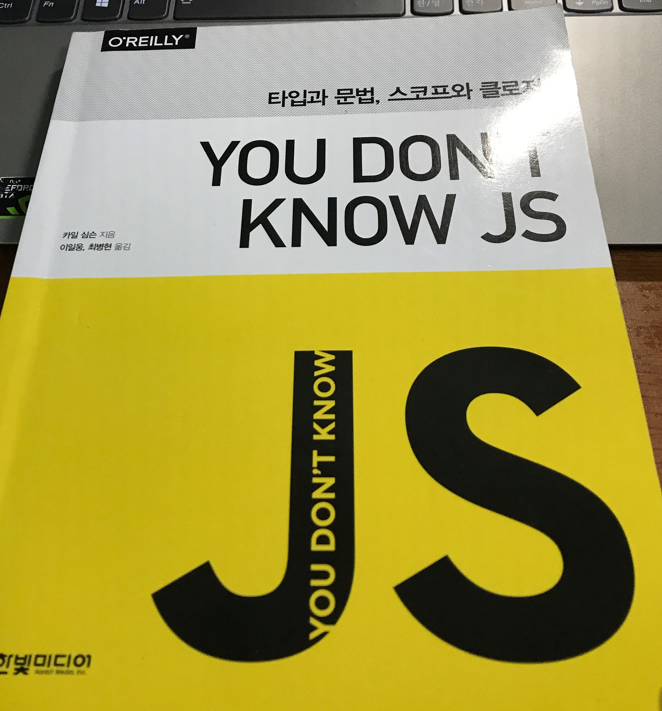

# You don't know JS 타입과 문법, 스코프와 클로저.

# 20201108 기준 작성 중인 블로그.
# 아직 작성 중인 블로그 입니다!!!

## 들어가며 

&ensp;사실 이 책을 읽기 시작한지는 꽤 오래 되었다. 이 책은 2020년도 8월 초 부터 읽기 시작했는데, 각종 면접준비 코딩테스트 준비, 출근  등의 이유로 읽지 못하고 있다가 최근에 다시 생각이 나서 완독을 하게 된 책이다. 이 책은 시리즈로 되어있는데, 한글 번역본은 " 타입과 문법, 스코프와 클로저. " 편과 "this와 객체 프로토타입, 비동기와 성능" 편이 나와있는 것으로 알고 있다. 그 중에서 기초 느낌의 타입과 문법, 스코프와 클로저를 먼저 읽었는데, 읽으면서 정말 평소에 어림 짐작으로 그러려니 하던 자바스크립트의 문법적인 동작, 원리 등을 명확히 알려주는 책이었다. 또한 읽으면서 대학교 수업 중 Programming Languages(프로그래 언어론) 수업에서 들은 내용들이 나와 오랜만에 관련 내용을 되짚어볼 수 있어 유익했다. 물론 한번 읽어서 책의 전체 내용을 모두 소화해내기는 어렵지만, 굉장히 많은 도움을 주는 책이었다. 다른 자바스크립트 입문서에는 나오지 않는 세세한 원리들을 배우는 재미가 있었다. 앞서 말했듯 한번 읽어 책의 내용을 모두 흡수하기 힘드니 리뷰를 하면서 한 번 더 중요 사항들과 재미있게 읽었던 부분들을 상기해보려고 한다. 

## Part 1-1. 타입

* 타입, 그 실체를 이해하자.
* 내장 타입 
* 값은 타입을 가진다

## Part 1-2. 값

* 배열
* 문자열
* 숫자
* 특수값
* 값 vs 레퍼런스

## Part 1-3. 네이티브

* 내부 [[Class]]
* 래퍼 박싱하기
* 언박싱
* 네이티브, 나는 생성자다. 

## Part 1-4. 강제변환 

* 값 변환 
* 추상 연산
* 명시적 강제변환
* 암시적 변환
* 느슨한/엄격한 동등 비교
* 추상 관계 비교

## Part 1-5. 문법
* 문과 표현식
* 연산자 우선순위
* 세미콜론 자동 삽입
* 에러
* 함수 인자
* try-finally
* switch

---
## Part 2-1. 스코프란 무엇인가

* 컴파일러 이론
* 스코프 이해하기
* 중첩 스코프
* 오류

## Part 2-2. 렉시컬 스코프

* 렉스타임
* 렉시컬 속이기

## Part 2-3. 함수 vs 블록 스코프

* 함수 기반 스코프
* 일반 스코프에 숨기
* 스코프 역할을 하는 함수
* 스코프 역할을 하는 블록

## Part 2-4 호이스팅

* 닭이 먼저냐 달걀이 먼저냐
* 컴파일러는 두 번 공격한다.
* 함수가 먼저다

## Part 2-5 스코프 클로저
* 깨달음
* 핵심
* 이제 나는 볼 수 있다. 
* 반복문과 클로저
* 모듈

---

## 다양한 환경의 자바 스크립트

* ECMAScript 
* 호스트 객체
* 전역 DOM 변수
* 네이티브 프로토 타입
* script 들
* 예약어
* 구현 한계

## 스코프와 렉시컬 this
* 동적 스코프
* 플로필링 블록 스코프
* 렉시컬 this

[YOU DON'T KNOW JS 타입과 문법, 스코프와 클로저](https://www.hanbit.co.kr/store/books/look.php?p_code=B8227329776)
