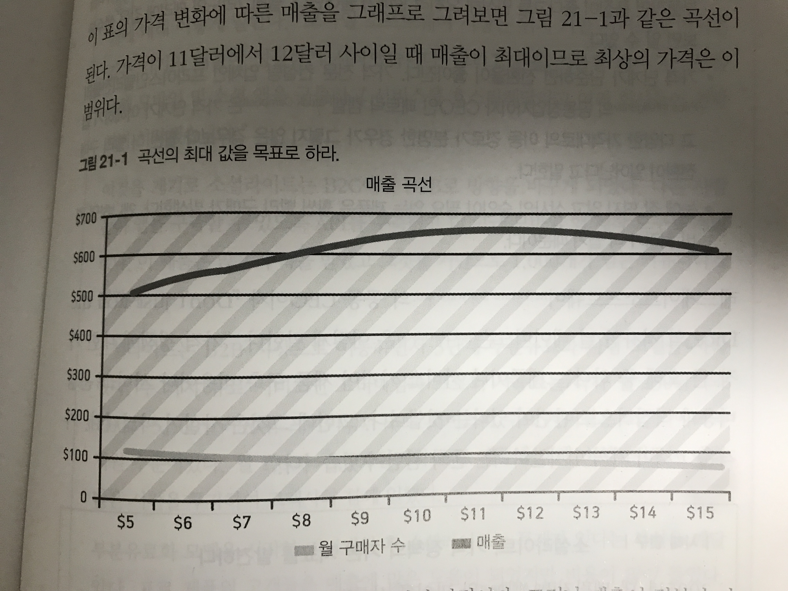
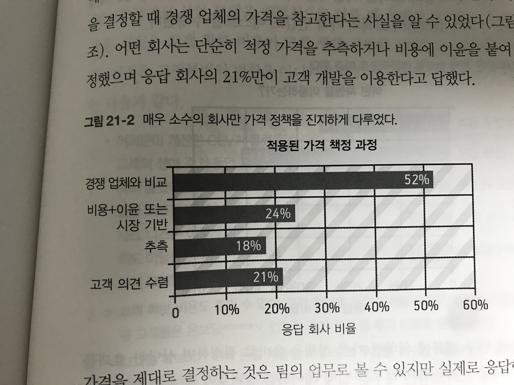
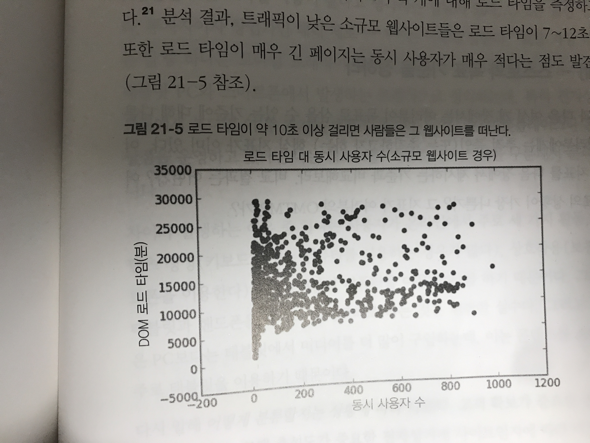

# 목표 기준
이전 장에서 어떤 지표들이 우리에게 유익하고 중요한지 함께 스터디했다. 그런데, 이 지표들 별로 어떤 목표 수치가 적정한 수치일까? 
이 기준이 명확하지 않으면 목표를 달성했는지, 우리가 잘 가고 있는지 알기가 어렵다. 이번 장에서는 지표별 적정 수치를 알아보자. 

## 21. 현재 상황.

"무엇이 정상적인가"를 알아보자. 사실 사업 마다 다르고, 환경마다 다르기 때문에 일반적인 값을 찾기는 어렵다. 
하지만 다음의 두 가지 이유 때문에 "정상 적인 지표"를 찾는 것이 중요하다고 한다. 

1. 우리의 사업과 다른 사업이 비슷한 양상을 나타내고 있는가를 기준 삼을 수 있다.  (일반적인 양상이있다.)
* 다른 사업과 터무니 없이 다르다면 그 사실을 빠르게 파악해야 한다. 
반면에 우리의 사업이 특정 지표에 대해 이미 목표를 달성했으면 다른 초점으로 옮겨야 한다. (괜히 건드려서 악영향이 생길 수 있음.)

2. 온라인 지표는 유동적이어서 현실적인 기준을 찾기 힘들다. 때문에 같은 업계 대비 우리가 어떤 상황에 놓여있는지 알 필요가 있다.
* 몇년 전만 해도 전자상거래 사이트 전환율이 1~3%였다. 유명 브랜드여도 7~15%였는데, 최근엔 소비자들이 웹환경에 익숙해져서 전환율이 굉장히 높아졌다. 

위 두가지를 정리해보면 대부분의 지표는 일반적인 값 또는 적정한 값이 있고, 특정 사업 모델이 새로 등장해서 주류가 되면 정상으로 간주되는 지표값이 크게 바뀐다. 

#### 사례1 워드 프레스 

워드 프레스는 창업 이후 연간 2%의 고객들이 이탈하는 것을 걱정 했는데, 이 업계의 평균에 비하면 굉장히 좋은 비율이었음. 
이 사실을 알지 못했으면 이미 좋은 지표를 더 개선하기 위해서 시간과 비용을 사용했을텐데 다른 것에 집중할 수 있게 되었다. 

* 평균으로는 충분하지 않다. 

평균값은 실적이 좋지 않은 회사들의 지표와 좋은 지표를 모드 포함한 값이기 때문에 평균을 달성했다고 다음 단계로 넘어가기에 지표가 적절하다고 할 수는 없다. 

### 성장률 (폴그레이엄)

스타트업은 세가지 성장 단계를 거친다고함. 
1. 회사가 적절한 제품과 시장을 찾는 느린 단계
2. 대량으로 제품을 만들고 판매할 방법을 찾는 빠른 성장 단계
3. 대기업이 되어서 중간함정을 극복하려고 노력하는 느려진 성장 단계. 

매주 5~7%의 성장률을 좋은 성장률이라고 한다. 10%는 훌륭. 

: 우리 회사의 고객 성장률은? 

* 어떤 대가를 치르고라도 성장하는 것이 좋은 일인가?

너무 일찍 성장에 초점을 맞추는 것은 좋지 않다. 새로운 방문자가 많아지면 성장의 기반이 되겠지만.
흡인력을 갖추지 않는다면 이미 방문한 자들에게 만족감을 주지 못할 수 있음. 유료화도 동일한 문제가 있다.

: 우리는 흡인력을 충분히 갖추었는가?

"지속가능한 성장은 가장 열성적인 고객이 느끼는 솔루션의 가치에 대한 깊은 이해를 기반으로 구축됨." 즉, 고객이 원하는 것을 먼저 갖춘 후에 (흡인력)
성장을 하는 것이 중요하다는 것이다. 네트워킹이 중요한 회사의 경우는 이런 방향이 맞을수 있지만 그 반대의 경우에는 적합하지 않을 수 있다. 

B2B : 
고객사에게 맞춤제품을 제공하다가 표준화된 범용 제품및 서비스를 제공한다. B2B 조작을 섣불리 성장시키면 사업 구축에 필요한 충성도 높은 고객과 멀어질 수 도 있음. 

문제를 정말 해결하고 싶어하는 사람이 충분이 있어서 성장률을 5%로 유지 할 수 있을지 생각해봐야함. 

### 참여 사용자 수 (프레드 윌슨)
동시 사용자 수에서 일관된 수치를 보인다. 

1. 회원 가입한 사용자의 30%가 웹 기반 서비스를 한달에 적어도 한번은 사용한다. 
2. 회원 가입한 사용자의 10%는 매일 이용한다. 
3. 최대 동시 사용자는 일 사용자 수의 10% 수준이다. 

30/10/10 

회원 가입한 사용자의 30%가 한 달에 한번 방문하고 10%가 매일 방문 하는 것을 목표로 삼아라. 
: 우리는 가입 사용자의 몇 %가 한달에 한번 방문하고 매일 방문할까?

### 가격 지표 (앨프레드 마셜)

"어떤 시장에서 가격 하락 폭에 비해 수요가 많이 증가하면 수요의 탄력성이 크고 적게 증가하면 탄력성이 작으며, 가격 상승 폭에 비해 수요가 많이 감소하면 탄력성이 크고, 적게 감소하면 탄력성이 작다."

: 가격을 어떤 기준으로 정하는가? 여러 실험을 해보는게 좋지 않을까?

가격에 따른 사용자의 탄력성에 의해서 매출이 결정되는데, 이 수치를 최적화 시킬 필요가 있다. 
가격 실험을 하는 내용이 퍼지면 이미지에 악영향을 줄 수 있다. 

* 가격은 제품이나 서비스 가격이 제품 구축 비용이나 서비스 운영 비용과 직접적으로 관련이 있는 것은 아님. 
오히려 고객이 지불하려는 돈과 관련이 있음. 즉, 고객이 제품에 어떤 가치를 느끼는지에 따라서 가격이 결정되는 것임. 

#### 소셜라이트 가격 정책의 기본 지표

스티키 노트를 붙이고 함께 정보를 공유하는 커뮤니티 서비스임. 가격 정책에 초점을 두지 않았었는데, 고급 사용자들의 특별 기능 수요가 생김. 
이 계기로 소셜 라이트는 B2C에서 B2B로 방향을 바꿈 -> 우리와 비슷한 방향인 것 같음. 

부분유료화도 했는데, 이 때 프리미엄은 250달러이고 프로는 1000~5500이었다. 이 때 프로도 고객사에 많은 시간을 투자해서 함께 일했으나 고객이 얻는 이윤에 비해 이익이 너무 낮았다. 
(고객이 생각하는 가치 + 고객이 가져다 주는 가치) 비해 너무 낮게 가격을 책정한 것이다. 

소셜라이트는 이 것을 발견하고 pro를 5500으로 통일해 인상했다.  

* 일반 사용자에서 기업용 시장으로 사업 방향을 바꾸었고 가격 정책을 수정했다.
* 높은 매출을 일으키는 고객들이 오히려 제공하는 기능이 많아 수익성이 높지 않았다.
* pro를 비상식적으로 높게 올려서 꼭 필요한 사람들만 사용하도록 했다. 
* 가격 정책별로 매출을 측정하는 것도 중요하다. 

- 무엇이 적절한 가격인지에 대한 분명한 규칙은 없지만 어떤 가격을 선택하든 테스트가 중요하다. 
매출량과 판매량 사이의 균형을 맞추고자 하면 적절한 가격 단계와 가격 탄력성을 이해하는 것이 중요하다. 

### 고객 확보 비용 

고객 한명을 얻기 위해 사용되는 비용은 얼마가 적절할까? 고객이 제품을 사용하면서 발생시키는 전체 매출 대비 비율로 정의 할 수 있다. 
개략적 원칙은 (고객확보비용/고객생애가치)<=(1/3) 여야 한다는 것이다. 이 근거는 다음과 같다. 

* 불확실성이 존제하기 때문이다. 이탈률을 과소 평과 하거나 매출을 과대 평가 했다면 에러 마진이 필요하다. 
* 고객 확보 비용도 틀릴 수 있어서 에러마진이 필요하다
* 고객 확보 비용을 사용하면 고객에게 돈을 '빌려준것'이기 때문에 회수하기까지 오래걸리면 돈이 계속해서 필요해질 것이다. 
* 고객 확보 비용을 적게둠으로써 고객 확보 비용을 더 일찍 재검토하게 된다. 

### 바이럴 효과 

바이럴 효과에는 두가지 지표가 있음. 
* 바이럴 계수
* 바이럴 주기
하지만 이 지표에 정상 값이 없음. 두 지표 모두 제품 성격과 시장 포화 상태에 따라 결정됨 .

* (바이럴 계수 < 1): 성장성이 매우 높음, 흡인력에 초점을 맞춰야 할 때

- 바이럴 효과의 전형적인 값은 없으나 0.75 이상이면 사업이 잘 진행되고 있다고 볼 수 있다. 
내제된 바이럴 효과를 제품에 넣고 이 지표를 추적하는 것이 중요하다. 
그리고 인위적 바이럴 효과는 고객 확보 활동과 동일하게 책정해야한다. 

### 메일링 리스트 효과 

산업에 따라 오픈율이 다르다. 2010년 연구에 따르면 

* 건설 주택, 정원 : 30%
* 의약품, 정치, 음악 : 14%

고객군 별로 다르게 메시지를 바꾸면 오픈율이 15% 올라감. 

제이슨 빌링슬리는 이메일을 회원 가입 시간과 오픈율을 매칭해 테스트 해보도록 권장하고 있음. 
또한 메일의 제목도 중요한 역할을 한다. 

- 오픈율과 클릭율은 경우에 따라 달라진다. 오픈율은 20~30%가 적절함. 

### 작동 시간과 신뢰성

정적인 웹사이트의 10개의 클라우드 서비스를 테스트한 결과 3%의 오류율을 보여줌. 작동 시간을 99.95%이상으로 유지하려면 비용이 많이 든다. 
이러한 부분을 차라리 고객에게 상황을 안내하자. 
- 사용자 들이 많이 사용하는 유료 서비스 (이메일, 프로젝트 관리앱, ex 카카오톡) 등은 99.5% 이상이어야 하고 상황공유를 잘 해야한다.
다른 것들은 좀 괜찮은편. 

### 웹 사이트 인게이지먼트

* 렌딩 페이지에서는 1분이 평균적인 사용시간
* 이외에는 76초가 평균. 

* 우리같은 경우엔 더 길듯하다. 

### 웹 성능 

페이지 로드 시간. 로드 타임이 10초 이상 걸리면 고객들이 떠난다. 
우리도 로드 시간을 개선하는 것이 좋을 것 같다. 

* 5초 안에 로드 되도록 해야 한다. 

## 22. 전자상거래: 목표 기준.

구매 전환율 : 
온라인 상점을 운영하고 있다면 초기 전환율은 2%가 될것이고 판매 상품마다 다를 것이다. 
전환율이 10%라면 사업을 매우 잘 운영하고 있는 것이다.

장바구니 포기율 : 

## 23. SaaS: 목표 기준.

## 28. 목표로 할 기준치가 없는 경우.