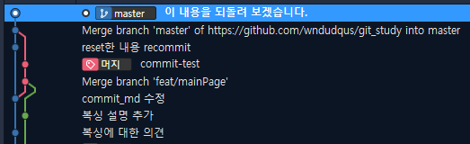

# git reset, revert

# 커밋을 되돌리는 방법 두가지 reset, revert

&ensp;잘 못된 커밋을 했을때, 잘못된 커밋 메시지를 작성해서 커밋 했을 때, 혹은 커밋 이전 상태의 코드가 필요할 때 커밋을 되돌리고 싶은 경우가 많다. 이럴 때 사용할 수 있는 방법은 대표적으로 reset과 revert 2가지가 있다. 이 둘을 처음 보면 이 둘의 차이를 잘 모르겠고,, 무지로 부터 오는 여러 고민이 생기는 것 같다. 간략히 설명하자면 reset은 HEAD를 되돌려 commit 기록까지 완전히 없애는 기능이고, revert는 이를 되돌리는 커밋을 하나 더 만들어 commit 하는 것이다. 아래에서 조금 더 세세하게 알아보자! 

### 실습 방법

본인은 history 등을 확인 하는 것은 source tree를 이용하고 reset revert 등의 명령어를 사용하는 것은 git bash가 편해 git bash로 명령어를 사용하고 history를 source tree로 확인했다.


# reset

&ensp;reset은 위에서 설명했듯이 커밋 기록마저 없애면서 커밋을 되돌리는 것이다. 



&ensp;이 커밋을 되돌려야야 하는 상황이라고 해보자. 
이러한 상황에서 reset을 이용하면 쉽게 위의 커밋을 삭제 할 수 있다. reset 명령어는 다음과 같은 방식으로 사용한다.
```git
$ git reset [--soft,--mixed,--hard] <돌아가고싶은 커밋>
```
&ensp; reset을 할 때는 옵션을 줄 수 있는데 --soft, --mixed, --hard 등이 있고 각각의 옵션에 따라 헤드를 해당 커밋으로 옮긴 후 파일, 커밋 정보들을 어떻게 할지 설정 할 수 있다. 또한 명령어의 마지막 구문인 <돌아가고싶은 커밋> 은 커밋의 해쉬를 입력해 돌아가도 되고, HEAD~1 와 같이 현재 커밋으로 부터 몇 커밋 전인지를 HEAD~ 뒤에 숫자로 입력해도 된다. 함께 해보며 각각의 차이점을 알아보자.
## --soft

&ensp;soft 옵션은 헤더를 되돌리고, 해당 커밋 명령어가 실행되기 바로 전으로 돌아간다. 즉 staging에 변경사항들이 올라가있는 상태까지만 되돌리는 것이다. 개인적으로는 해당 옵션을 가장 많이 사용한다. 함께 확인해보자

&ensp;위의 커밋 상태에서 아래의 명령어를 실행하면
```git
git reset --soft HEAD~1
```
&ensp;아래와 같은 상황이 된다. 


&ensp;"이 내용을 되돌려 보겠습니다." 커밋이 사라지고 커밋하지 않은 변경사항으로 바뀐 것을 알 수 있다. 그리고 staging된 파일을 확인해보면 해당 커밋에서 staging 해두었던 것이 유지되는 것을 확인 할 수 있다. 


## --hard

&ensp;이번엔 hard 를 이용해 "이 내용을 되돌려보겠습니다." 커밋을 삭제해보겠다.  명령어는 다음과 같다. 

```git

git reset --hard HEAD~1

```

&ensp;위의 명령어를 실행시키면 현재 상태는 아래와 같이 변하게 된다. 


&ensp;즉 커밋 기록도 변경 사항도 모두 삭제 되는 것이다. 이 작업은 신중히 실행해야 한다. 하루종일 작업한 내용이 그대로 날라갈 수도 있다!

## --mixed
&ensp;이번엔 --mixed를 이용해 "이 내용을 되돌려보겠습니다." 커밋을 삭제해보겠다. 아래와 같은 명령어를 이용하면 된다. 

```git
git reset --mixed HEAD~1
```

&ensp;그결과는 아래와 같이 히스토리가 지워진 것을 확인 할 수 있다. 


&ensp;스테이징에 올라가기 전에 변경점이 있는 파일이 트래킹이 된 상태로 나타나게 된다. 


# revert
&ensp; revert는 reset처럼 이전 버전으로 상태를 돌릴 수 있지만 커밋 이력이 유지되고 거기에 revert 커밋이 추가적으로 기록에 남게 된다.  이번에도 위에서 보인 예와 같은 예를 통해 확인 해보겠다. 
 명령어는 다음과 같다. 
 ```git 
 git revert <되돌아갈 커밋 번호>
 ```
 &ensp;revert를 실행시키게 되면 아래와 같이 히스토리가 생기게 된다. 


 &ensp;이전 되돌릴 커밋은 남게되고 변경사항들이 아래처럼 스테이징된 상태로 올라가있게 된다.

 

 &ensp;이 상태에서 commit 내용을 수정하고 다시 커밋 하게 되면 히스토리는 아래와 같이 남지만 내용을 변경할 수 있는 것을 확인 할 수 있다. 
  

# 마치며
&ensp;reset을 해보면 알겠지만 본인의 작업이 원격 저장소에 저장되어있다면 push가 안되는 것을 알 수 있을 것이다. 이럴 때는 git push -f 를 통해 강제 push를 하면 해결이 된다. 저자 본인은 개인 브랜치를 따서 피쳐를 개발하고 PR을 통해 머지를 하는 방식으로 작업을 하기 때문에 reset 후 git push -f를 통해 원격 저장소의 히스토리도 정리한다. 하지만 만약 다른사람들과 같은 브렌치를 사용하고, 다른 사람이 pull을 받았을 경우는,,, revert를 통해 해당 커밋을 되돌리는 것이 좋다. 만약 reset을 통해 커밋을 되돌렸을 경우 다른 사람들과의 커밋의 버전이 달라 문제가 생기게 된다. 

&ensp; 두 명령어의 차이를 정확히 이해하고 앞으로는 커밋을 되돌려야 하는 상황에서 당황하지 말고 적절한 처리를 하자!

# 참고자료 
* [Git 도구 - Reset 명확히 알고 가기](https://git-scm.com/book/ko/v2/Git-%EB%8F%84%EA%B5%AC-Reset-%EB%AA%85%ED%99%95%ED%9E%88-%EC%95%8C%EA%B3%A0-%EA%B0%80%EA%B8%B0)

* [개발 바보들 git-back-to-the-future](http://www.devpools.kr/2017/01/31/%EA%B0%9C%EB%B0%9C%EB%B0%94%EB%B3%B4%EB%93%A4-1%ED%99%94-git-back-to-the-future/)

