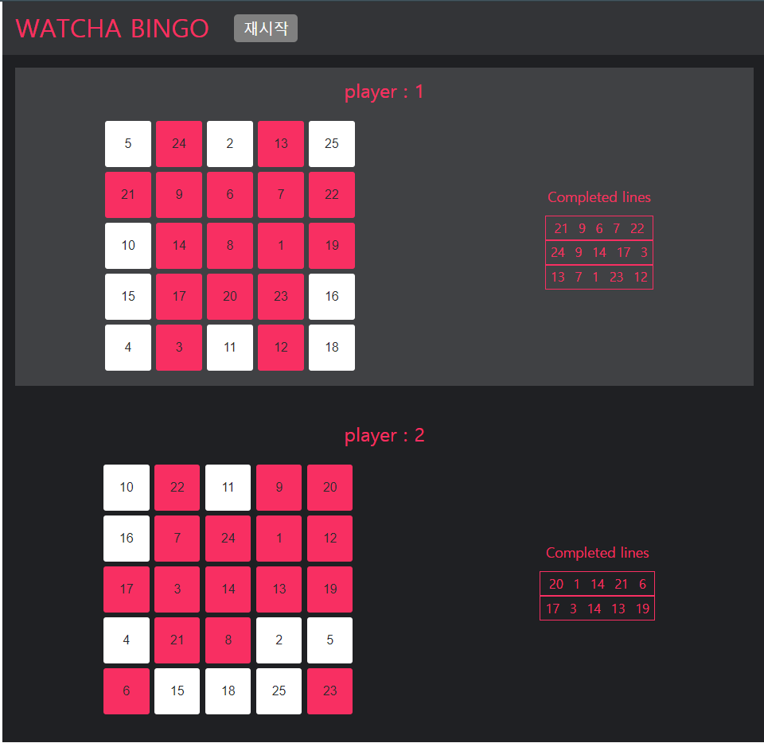
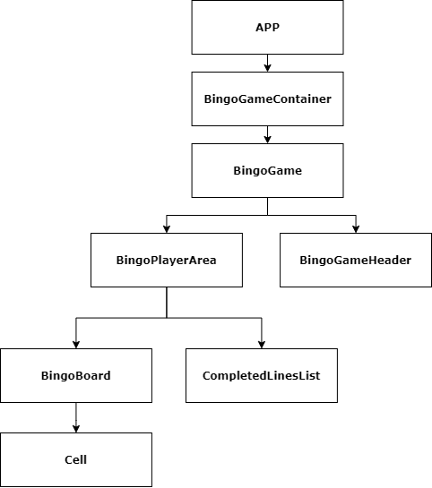

## 들어가며 

&ensp;최근 왓챠의 과제전형을 통해 리액트와 리덕스를 이용해 빙고를 만들어볼 기회가 생겼다. 리덕스를 학습한지 꽤 오랜만에🤣 다시 빠르게 복습해서 만들었는데, 꽤나 재미있게 만들었던 프로젝트 같다.이번 글에서는 프로젝트를 진행하기 위해 했던 고민들과 만든 뒤에 생각난 개선사항들을 한번 적어보았다.

## 데모 & github


<br/>
&ensp; 먼저 아래의 데모를 확인해보자! 어디에 내놓을 정도로 특별하거나 대단한 프로젝트는 아니지만, 개인적으로 프로덕트가 하나 내 손으로 만들어지면 자꾸만 여기저기 보여주고 싶어서 넣어보았다. 😁

* [Bingo-with-react-and-redux-데모](https://wndudqus.github.io/bingo_with_redux/)
* [Bingo-with-react-and-redux-소스](https://github.com/wndudqus/bingo_with_redux)

## 프로젝트 설명
&ensp; 본 프로젝트는 간단하게 리액트와 리덕스를 이용해서  5*5 빙고게임을 만든 프로젝트로 일반적인 빙고와 같은 규칙을 가지고 있다.
세세한 요구사항은 작성하지 않겠지만(혹시 몰라서..🤣) 대략 다음과 같은 기능이 제공되어야 했다.

    1. 시작 버튼을 누른 후 보드판이 채워져야 한다.
    2. 보드판이 채워지면 Player1부터 Player둘이 번갈아가며 게임을 진행한다.
    3. 완성된줄은 완성된 빙고 목록에 나타나야 한다.
    4. 5개의 빙고가 먼저 완료된 player가 승리하고, 게임은 초기화된다.

## 프로젝트를 받고... 구조를 잡자!
&ensp; 이 프로젝트를 처음 받았을 때 가장먼저 한 것은 <b>요구사항을 뚫어져라 보면서 꼼꼼히 확인 했다.</b>🧐 만약 다른 상황이었다면 해당 기획을 한 사람과 논의를 하면서 추가할 아이디어와 주의해야 할 상황에 대해서 많이 이야기를 한 후 진행을 했겠지만 이번 상황은 그렇지 않고, 이 상황에서 기획사항에 대한 최선은 요구 사항을 꼼꼼히 보고 완전히 이해하는게 최선이라고 생각했기 때문이다. 그 후에는 사용자의 입장에서 머릿속으로 게임을 수행해보기도 하면서 발생하는 이벤트들과 필요한 컴포넌트, action들을 대강 생각해본뒤 아래의 순서로 구체화 시켜 나갔다. 

##### 1. flow를 보며 필요한 Action 들을 설계해 보자!
&ensp; 그 후로는  bingo 게임의 flow대로 코드가 돌아갈 때 어떠한 이벤트들이 실행될지, 이에 따라서 store의 state를 변화시킬 때 어떤 Action들이 필요할지를 생각했다. 그 결과 다음과 같은 Action들이 필요하다는 결론이 내려졌다.  (실제 프로젝트에서 네이밍은 조금 다르게 했지만 다음과 같은 기능들을 하는 action들이 필요하다고 생각했다.)

    1. INIT- 게임 시작을 했을 때 보드에 값을 초기화 해주고, game의 상태를 시작 상태로 바꿔주기 위한 action
    2. SELECT_CELL- 사용자가 셀을 선택 했을 때 cell에 대한 정보를 바꾸고, 게임의 round 와 현재 플레이어를 바꿔줄 action
    3. RESET- 5빙고를 완료했을 때 게임을 완전히 처음 상태로 만들어주는 action 

사용자가 빙고를 이용하는 flow를 생각해 보니 위의 action들이 필요할 것 같다는 생각이 들었다. 
##### 2. flow와 인터랙션을 생각하며 필요한 UI를 설계해 보자!
&ensp;그 후에는 사용자가 이용할 UI의 컴포넌트들을 어떻게 나눌까를 고민했다. 필자는 보통 리액트를 이용해 프로젝트를 구성할 때 사용할 상황들을 생각하고 그 다음으로 UI 구조를 먼저 생각하는 편이다. 리액트의 경우 컴포넌트 기반으로 프로젝트를 조립하듯이 구성해나간다. 이 때문에 컴포넌트를 나누어 설계해보면 각 컴포넌트에서 필요한 데이터가 구체화가 자연스럽게 되어 UI 구조를 먼저 잡는 것을 좋아한다. 그래서 아래와 같이 구조를 먼저 잡고 프로젝트를 진행했다.

<br/>
버튼과 같은 자주 사용될 것 같은 요소들도 컴포넌트로 만들어서 재사용했지만 너무 간단한 컴포넌트여서 위의 트리에는 표기하지 않았다.


##### 3. 구체화된 action과 Component를 기반으로 필요한 state를 뽑아내자!

 이렇게 Action과 Component 들에 대해 생각을 해보니 자연스럽게 Component들이 가져야할 state들이 어떤 것이 있는지, action이 변경시킬 상태들이 어떠한 것들이 있는지 구체적으로 생각해볼 수 있게 되었다. 그리고 이를 통해 구체화된 상태데이터 들에 대해서 자연스럽게 구조를 어떻게 잡아야할지 고민하게 되었다. 그 구조들은 대략 아래와 같이 생각해 볼 수 있었다.(물론 아래 정리 된 것 보다 더 rough 하게 정리 되었는데 데이터 중복성 등을 고려해서 삭제 했다.)
```ts
BINGO
| 
isPlaying:boolean; // 현재 게임이 시작된 상태인지 나타낸다.
|
currentPlayer:number;// 현재 시점에 게임을 하고 있는 플레이어
|
currentRound:number// 현재 게임이 시작된 후 몇 라운드째 인지
|
Players:BingoPlayerAreaInfo[]// 한 플레이어가 소유한 게임의 화면 영역(플레이어 번호, 보드영역 컴포넌트, 완성된 줄 컴포넌트)들의state
|____playerNumber: number; //플레이어 번호
|____isCurrentPlayer: boolean;// 현재 차례의 플레이어인지 (없었어도 될 것 같긴 함.. 이제 와서 보니 데이터 중복)
|____cells: CellInfo[][];// 플레이어가 가지는 
    |____id: number //각 셀에 할당되는 번호 (한 보드 내에서 유일하다.)
    |____boardNumber:number; //해당 셀이 속하는 보드 번호
    |____isChecked:boolean; //해당 셀이 체크가 되었는지
|____completedLine: CellInfo[][]; //본 사용자가 완성한 줄 목록 
```

## 어려웠던 점
해당 프로젝트를 진행하면서 어려웠던 점은 2가지 정도 있었다.
1. 오랜만에 리덕스를 이용해서 프로젝트를 하려다 보니 리덕스에 익숙하지 않아서 조금 해매기도 했던 것 같다. 그래도 이 부분은 이전에 근무했던 회사에서 flux 패턴을 지속적으로 사용했었고, 이전에 리덕스를 학습하고 사용해본 경험이 있어 금방 극복할 수 있었다. 
2. cell 들의 상태를 업데이트 해주는 action의 처리가 조금 복잡했다. 특히 select 시에 cell의 check만 해주는 것이 아니라 완료된 라인이 있는지 체크하고 이에따라 완료된 라인을 추가해주어야 해서 여러 작업이 동시에 일어나서 조금 복잡했던 것 같다. 코드가 복잡해져 불변성 유지를 신경쓰기 어려워졌는데 코드를 함수단위로 분리해 util파일으로 넣어 해당 함수에서 처리가된 새로운 array가 반환되도록 해서 코드의 복잡도를 줄이고 불변성유지에 신경쓰려고 노력했다.

## 과제전형 이후에 개선한 점
&ensp; 위에서 말했듯이 나는 내가 개발한 프로젝트는 간단한 것이라도 자꾸만 보고 자랑하고 고치고 개선하고싶어한다.. 그래서 생각을 하다보니 
아래와 같은 점이 생각나서 개선했다. (물론 다른 브렌치에) 
* 기존엔 action생성자와 이를 dispatch해주는 코드를 callback으로 만들어 root component부터 내려주었다. 문득,, useDispatch를 이용하면 훨씬 편하게 root->terminal 로 props형태로 전달하는 과정을 거치지 않고 바로 dispatch 를 할 수 있겠다고 생각이 들어 useDispatch를 이용해 해당 컴포넌트에서 바로 callback을 정의해 이벤트리스너를 등록해주었다.


## 추후 개선할 점
데이터 구조에 대해서 어떤 구조가 더 좋은 것인지 많이 고민해보고 개선해보고싶다. 예를 들어 데이터 중 isCurrentPlayer 같은 경우는 current player를 넘겨주어 비교해 처리하면 좋을것 같다. 데이터 구조를 개선해보자!!!

## 사용한 기술들
* Typescript
* React
* styled-components
* reset-css
* redux
* react-redux
* redux-devtools-extension
* gh-pages

## 회고
&ensp; 너무 재미있었던 프로젝트였다. 더 리액트스럽게, 더 리덕스 구조에 맞게 짤 수 있는 방법이 있다면 배우고싶다! 그리고 사긴이 되면 사용한 기술들을 하나하나 소개하는 글도 쓰고싶다..


